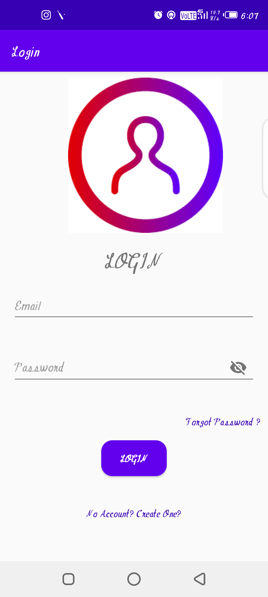

# NotesDiary

This is Android App, which basically keeps the record of notes created by user.
User can ***create, delete*** and ***edit*** their notes with ***user friendly Interface***. 
In this app user can ***create their account*** before creating notes, In this way other user cannot access their data.
User can also ***search their notes*** using note's title and ***share*** their notes using any sharing app.
App also loaded feature such that when user create new note, then created date also noted recorded and when user edit their app, then edited date recorded in firebase.
TextToSpeech feature is also present which convert title and description to speech.

* ***IDE USED*** : *Android Studio*
* ***LANGUAGE USED*** : *JAVA*
* ***DATABASE USED*** : *Firebase Realtime*

	
	   	
	   	
		   	
	          
	          
